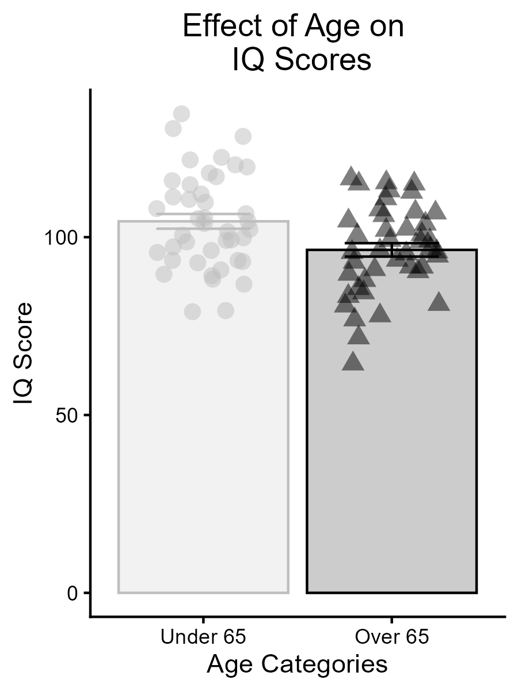
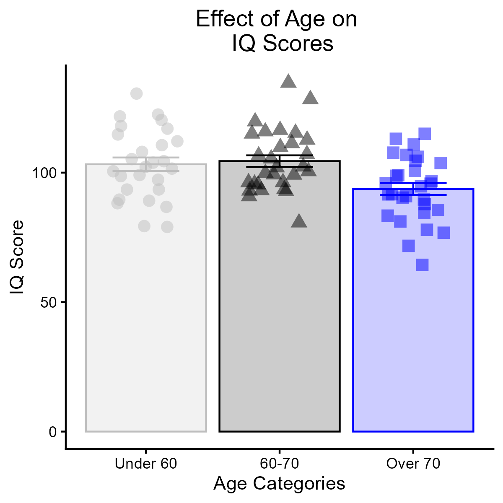

---
output:
  word_document: default
  html_document: default
---

```{r setup_2, include=FALSE}
knitr::opts_chunk$set(echo = TRUE,
                      message = FALSE,
                      warning = FALSE)
```

# Practical Assignment #5: Connecting the IV and Covariate

## Assignment Instructions

### 1. Thinking About Causality {-}

**Strength of association** is a necessary step in determining whether there is a causal relationship between X and Y, but it is not sufficient for inferring causality. For your final assignment, you will be designing an experiment that involves at least 2 independent variables (The "IV" and the "covariate" that you have explored in the previous assignments). 

In prior assignments, you were already asked to provide a simple group comparison or manipulation (an IV) that could reveal a difference in your DV. Now, please **write a paragraph explaining this decision in more detail** - what is the theory or explanation for why this manipulation works?

### 2. What is already known? {-}

The second step is getting back into literature review. **Write a paragraph or two** in APA format describing what we know about your proposed manipulation and DV. What in the research literature (citing 2-3 papers) makes you believe that this manipulation will influence your DV? What direction is the proposed effect, i.e., does the manipulation increase or decrease your DV. 

Most importantly, we need to get specific about the expected change in the DV when you manipulate the IV. In your brief literature review, please report any measure of effect size, which will often be a cohen’s d or partial eta-squared (η2) or beta estimate (b). Best of all would be to see how much of a change in the DV in units of the DV the manipulation makes. 

### 3. Connect the theory of the IV-DV relationship to your proposed covariate.{-}

Explain how the continuous covariate might modulate the relationship between the IV and DV that you are proposing. Use literature to support your ideas. Be very clear about the proposed direction of the effects. Would you expect the IV to affect all levels of the covariate equally? Why or why not? 

Reference at least one article that suggests a relationship between your **independent variable** and **proposed covariate** to support your narrative. 

### 4. Transform the continuous covariate to a categorical variable {-}

Using the r-code that you developed in practical 4, have a look at your continuous covariate and continuous DV. Imagine that this continuous relationship represents the real-world construct. If you were to divide this continuum  into categories, how many would you use and why? Explain why it might make sense to use this number of categories (either from a statistical or a theoretical perspective).

Back to the code! Using the data that you simulated in practical 4, transform the continuous covariate into a new column that is categorical. Use ggplot to make a bar chart with error bars that represent the standard error of the mean and individual points to represent your theoretical participants' scores on the DV. Use the method that we learned in practical 4 to save off a high quality .png image of this chart, then call it back using knitr::kable(). 

Compute a statistical analysis to measure whether the categories that you selected differ significantly from one another on your DV. This analysis should either be a two-sample t-test or a one-way ANOVA (depending on the number of categories you chose). Interpret the analysis using an APA statement. 

Make sure that you have `echo = TURE, warning = FALSE, message = FALSE` set for your code blocks so that R will print out your code and the results, but will hide messages and warnings. 

### 5. Reflect {-}

What are the advantageous and disadvantages to transforming the continuous covariate into a categorical variable? Was it difficult to choose the number of categories to divide your covariate into? What did you think about generating a bar chart through ggplot? How did running your first statistical analysis through R go? Is there anything that would have helped you learn these processes more effectively? Any lingering questions? 

## Code for Practical #5 {-}

```{r, include=TRUE}
# Set up how the code chunks will print
knitr::opts_chunk$set(echo = TRUE, # Show the code
                      warning = FALSE, # Hide the warnings
                      message = FALSE) # Hide the messages

library(faux)
library(tidyverse)
```

### Generate data {-}

The block of code below is the same as what was computed in practical #4. Here, the theory is to generate two columns of data of a given n (i.e., number of rows) with an approximate correlation between the columns specified. The two columns should represent your chosen covariate and dependent variable. 

```{r}
# Set a consistent start point for "random" data generation
# Makes it so the output will be consistent

set.seed(123) # Can be any value; generates reproducible example. 

# Generate data. Specify the number of rows, number of variables, means for the columns, sd's for the columns, and the correlation between the columns.

data <- rnorm_multi(n = 85, vars = 2, mu = c(65,100), sd = c(10,15), r = -0.3)

# Rename the columns to represent your variables 
colnames(data) <- c("Age","IQ")

###### Everything above this point is copy & pasted from practical #4. 
```

### Transform {-}

Generate a 3rd column of data that will represent a categorized version of the covariate. Divite the participants into categories based on specified cut points. 

```{r}
# Transform the continuous variable into categories
data$age_cat <- cut(data$Age,
                    breaks = c(-Inf, 65, Inf), # cut points
                    labels = c("Under 65", "Over 65")) # labels
```

- Here, my new column will have the header **age_cat**. 

- People under 65 will be have the string "Under 65" in the new column; people 65 or over will have "Over 65". 

I could also use the `head()` function to check out the first 6 rows of the new dataframe: 

```{r}
head(data)
```

### Make a Bar Graph {-}

To generate a bar chart, I am going to combine the logic of the code that we learned in practical assignment #4 and practical assignment #5. I will first compute a summary of my data, then I will pipe that summary directly into `ggplot()` to create the chart. 


```{r,fig.cap="First example: Here, I divided the continuous covariate into two categories and plotted the data as mean value +/- SEM with individual datapoints overlain."}
# A bar graph
a <- data %>%
  group_by(age_cat) %>%
  summarise(
    n=n(),
    mean=mean(IQ),
    sd=sd(IQ)
  ) %>% mutate(se=sd / sqrt(n)) %>%
  ggplot(aes(x=age_cat,y=mean, colour = age_cat, fill= age_cat, shape=age_cat)) +
  geom_bar(stat="identity",alpha=0.2)+
  geom_errorbar(aes(x=age_cat,ymin=mean-se,ymax=mean+se),width=0.5)+
  geom_jitter(data = data,aes(x=age_cat,y=IQ),height=0, width=0.25, size=3,alpha=0.5)+
  scale_colour_manual(values = c("grey","black"))+
  scale_fill_manual(values=c("grey","black"))+
  theme_classic()+
  theme(legend.position = "none")+
  theme(plot.title = element_text(hjust=0.5))+
  labs(
    x="Age Categories",
    y="IQ Score",
    title="Effect of Age on \n IQ Scores"
  )

ggsave("2_bars.png",a,height=4,width=3,dpi=300)


```

- This code prints out a high-quality version of the chart from a saved high-quality .png image stored in the working directory.  

### Analyze {-}

In the chart above, we can see that the mean IQ scores are higher for the Under 65 group than for the over 65 group (compare the height of the grey bar to the height of the black bar). However, there is also plenty of overlap between the individual datapoints between the two groups. To understand whether this difference is ***significant***, we use statistics. In this case, we would run an independent samples t-test, because we want to compare the means of two groups. 

One assumption of the t-test is that the variance in the two groups is roughly equal. To assess whether this assumption has been violated, we can run the Levigne's test for the equity of variances using this line of code: 

```{r}
# Levigne's test for equity of variances
var.test(data = data, IQ ~ age_cat)
```

- In a test for an assumption violation, a non-significant p-value indicates that the assumption has not been violated. 

- Because the output above indicates *p* = .60, I interpret no assumption violation. Because the p-values is n.s., I will pass var.equal = TRUE to the subsequent command when generating the t-test. 

- By defualt, var.equal is set to FALSE in the `t.test()` function. To compensate for the violation of assumption, R uses something called the Welsh correction, which reduces the degrees of freedom in the analysis. For this reason, the df will often print as a partial value (e.g., df = 14.2).  


```{r}
t.test(data = data, IQ ~ age_cat, var.equal = TRUE)
```

- The t-test prints out all the info needed for APA-style statistical reporting (t, df, p-vlaue, 95% CI). 

- When writing up results of an analysis, it is important to ensure that you describe the ***nature of the group difference***, i.e., which group(s) had higher scores on your DV? It is not enough to say there was a significant difference in scores!

### 3-category exmaple  {-}

Some students choose to divide their continuous covariate into 3 categories for this assignment. The same logic could be scaled up to generate data representing 4 or more categories, if you wish. However, the more levels the categorized covariate has, the more complex the statistical outputs from the final project will be. Parsimony matters here! We encourage you think carefully about which number of categories makes most sense for your DV and why. 

I will show an example of modifying the code above to a 3-category example here. 

Suppose that I wanted to divide my continuous variable Age into 3 categories: Under 60, 60-70 year olds, and people over 70: 

```{r}
# An example of how to divide the continuous variable into 3 categories
data$age_cat <- cut(data$Age,
                    breaks = c(-Inf, 60, 70, Inf),
                    labels = c("Under 60","60-70", "Over 70"))
```

```{r}
head(data)
```

- I can see in a preview of the dataframe that now the levels of my age_cat variable have changed, as I requested above. 

The code below has been modified only to include an additional colour where I requested custom colours to represent each group.

```{r}
JLB_garph <- data %>%
  group_by(age_cat) %>%
  summarise(
    n=n(),
    mean=mean(IQ),
    sd=sd(IQ)
  ) %>% mutate(se=sd / sqrt(n)) %>%
  ggplot(aes(x=age_cat,y=mean, colour = age_cat, fill= age_cat, shape=age_cat)) +
  geom_bar(stat="identity",alpha=0.2)+
  geom_errorbar(aes(x=age_cat,ymin=mean-se,ymax=mean+se),width=0.5)+
  geom_jitter(data = data,aes(x=age_cat,y=IQ),height=0, width=0.25, size=3,alpha=0.5)+
  scale_colour_manual(values = c("grey","black","blue"))+
  scale_fill_manual(values=c("grey","black","blue"))+
  theme_classic()+
  theme(legend.position = "none")+
  theme(plot.title = element_text(hjust=0.5))+
  labs(
    x="Age Categories",
    y="IQ Score",
    title="Effect of Age on \n IQ Scores"
  )

# Save a high quality .png copy of the image
ggsave("JLB_prc_5.png",JLB_garph,height=4,width=4,dpi=300)

# Call back the high quality image

```

- Now I have three bars instead of two :) 

### Analyze 3-category example

When there are more than two groups, use ANOVA instead of a t-test. 

```{r}
# Run a one-way ANOVA
res <- aov(data = data, IQ ~ age_cat)

# Print out a summary of the results from the ANOVA
summary(res)
```

- This is a one-way ANOVA where the variable age_cat has 3 levels, which produces Df = 2 in the output above.

- In my output, the p-value is .003, indicating that the groups' means are not all equal. 

If the results from the omnibus test of significance indicate p < 0.05, run Tukey's honestly significant difference test to figure out *where* the group differences are. 

```{r}
TukeyHSD(res)
```

- There was no difference between people under 60 and people who were between 60 and 70 (*p* = 0.93).

- Participants in the over 70 group performed worse than both other groups (*p* = .017, *p* = .005, respectively).


