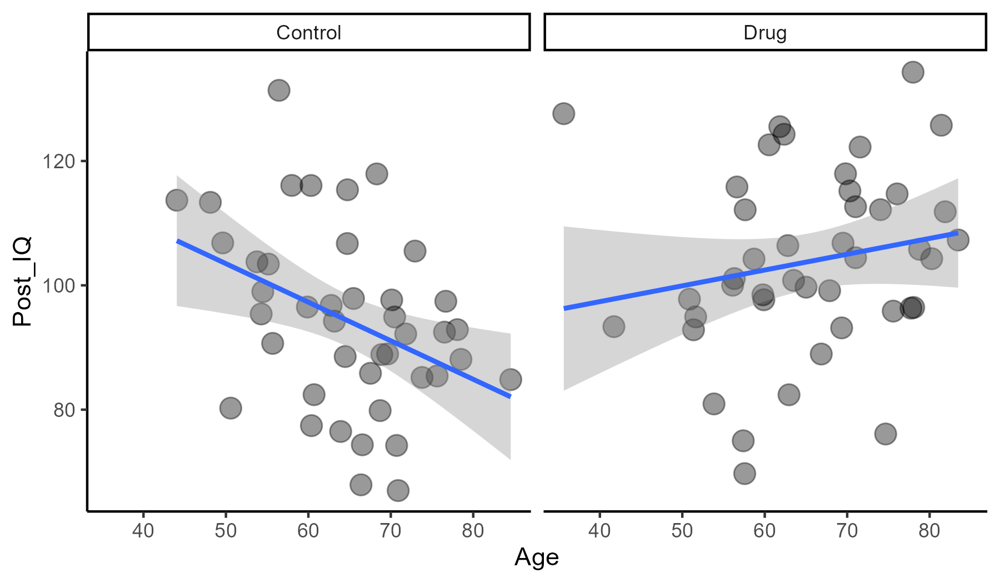
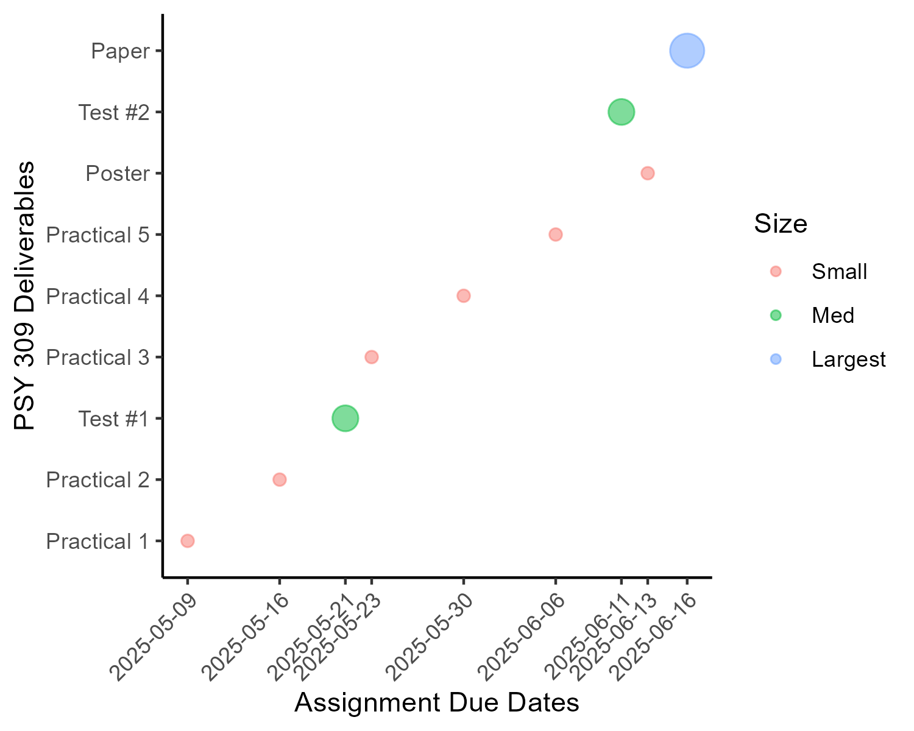

--- 
title: "A book of Practical Assignments for Psy309 at UTM Spring 2025"
site: bookdown::bookdown_site
documentclass: book
# url: your book url like https://bookdown.org/yihui/bookdown
# cover-image: path to the social sharing image like images/cover.jpg
description: |
  This is an organized index of the 5 practical assignments and the final writing project that PSY309 students at UTM will complete during the Spring 2025 semester. 
link-citations: yes
github-repo: rstudio/bookdown-demo
---

# About {-}

This is a series of assignments intended to help third year UTM students transfer their theoretical knowledge of using the general linear model from Psy201/202 to a computational approach in `Rstudio`. 

- 5 "practical" assignments help students to refine a research question, then generate fictitious data to represent their hypothesized effect.

- The final project involves synthesis of the practical assignments with additional analyses (3-way ANOVA and multiple linear regression).

- As they complete the assignments, students learn to think critically about research design and construct opperationalization. They also develop basic coding skills, which are combined with their theoretical understanding of statistics in the final written assignment. 


<!--chapter:end:index.Rmd-->

---
output:
  word_document: default
  pdf_document: default
  html_document: default
---

# Asking Scientific Questions and Literature Review 

## Overview {-}

The purpose of this assignment is to showcase your interest in a specific topic related to psychology, and to demonstrate your ability to find **scholarly sources** that make claims related to your topic. 

***Your submission should not be longer than 2 pages (including references)***

## 1. Choose a Reasearch Topic in Psychology {-}

**In a single paragraph (3-5 sentences), tell us what you would like to research.**

*Some questions that you could think over while selecting at topic:*

Why did you decide to study Psychology? There is some mystery about the mind, or some insight that you have had, that motivates you. Do you want to help people with a particular set of challenges? Do you want to understand growth and development? The way the brain works? How people interact? The possibilities are endless.

In this course you will learn how to develop a research proposal around a topic of your choice, one that could be the beginning of a grant proposal or a way to wow potential supervisors for grad school, or to impress potential employers who want to know if you can lead project. The more you make this something relevant to your own goals, the more useful this course will be.

It must be a topic in *psychology*: i.e., the study of the mind, and it should be something that can be studied *scientifically*, i.e., observed in such a way that other people could replicate your process and generate similar data. This topic will be the basis for your research project over the course of the semester, so please give it some thought!

## 2. See What's Out There {-}

Go to [the library PsycINFO page](https://guides.library.utoronto.ca/psycinfoovid), [Google Scholar](https://scholar.google.ca/), or similar academic search engine.

Conduct a basic search for a topic that you are interested in. If you would like more information about this process, we have multiple videos on conducting a literature search available online.

**Please write a few paragraphs describing:**

- The search engine(s) that you used 

- What were the *specific* search terms you used (so if we entered those terms, we should get the same output as you)

- How did you expand / change your search terms to focus on the types of studies you were most interested in? 

- Provide a reference list of 3-5 peer-reviewed, academic research papers on your research topic; the references should be listed in [APA format](https://guides.library.utoronto.ca/c.php?g=250462&p=1670709).

- At least one of your papers must be an empirical paper! 

**Provide a brief (3-5 sentence) summary of one empirical, peer-reviewed research paper from your list** (preferably one that represents an approach to your research topic that you find interesting.)

- Tell us what the paper was about and why you chose it - how did you know it was an empirical paper? What about it was interesting to you?
    + You don’t have to tell us everything about the paper- again just a 3-5 sentence summary in your own words, which means you must leave many details out! You will get into the details of this paper in the next two practical assignments. Note: you can change this ‘focus paper’ later if you find something better, but it is better to start with a specific paper in mind.
    + You will end up having to create an empirical research proposal by the end of the term, so this paper can be an important example for you to rely and build upon as the term goes on. The important thing is to pick a paper and dive in - this is a ‘safe space’ to just immerse yourself in a research approach, regardless of whether you actually perform research like this in the future!


## 3. Reflect {-}

**Write a closing paragraph (3-5 sentences) describing what it was like to try to find research on your topic.**

- Was it hard to pick a topic? Did your topic change based on what you found (or couldn’t find) during your literature review? What advice would you give to other students doing this assignment in the future?


<!--chapter:end:01-Practical_1.Rmd-->

---
output:
  word_document: default
  pdf_document: default
  html_document: default
---

# Exploring Types of Measurement in Research

Unlike other ways of knowing (epistemologies), the scientific method requires that we specify a way of measuring things in the world. It is important that the specified set of methods is described in such a way that other people could *replicate* the experiment, assuming that they have access to the necessary resources and training. 

## 1. Identify dependent variable(s) {-}

Think back to your submission from practical #1 (where you selected a general research topic and found some articles, with at least one of the articles performing empirical measurement).

Remind us about the research topic that you have chosen to focus on. This time, **use a _single sentence_ that cites the empirical article in APA style**. Please also provide the full citation for the paper as well, in APA format (make sure that the components of the citation are written using APA standard, but **do not worry** about formatting the citation with a hanging indent). 

For example: 

> On the topic of factors people’s enjoyment of meditation, researchers have observed that while most people expect to enjoy breath-focused meditation more than visualization or mantra practices, but approximately half of all participants change their minds after trying all three practices (Anderson & Farb, 2018).

> Anderson, T., & Farb, N. A. (2018). Personalizing practice using preferences for meditation anchor modality. *Frontiers in psychology*, *9*, 1-10.

**Describe the primary dependent variable in the research paper**. Remember that a *dependent variable* is something that is observed (or measured), and is outside of the researcher's direct control (i.e., the dependent variable is not manipulated). If your paper has multiple dependent variables, you can mention that, but please tell us which variable you consider to be the most important. 

## 2. Identify claim(s) made by the paper {-}

One of the main reasons that we measure things is to make a claim about a broader population or about future events. Remember that the three main types of claims we make are: *frequency*, *association*, or *causal* claims. Make sure that you connect the DV to the IV(s) here to explain the parameters of the research finding. 

**Describe which of the three claims is / are being made** in the paper that you outlined above and explain how you know (i.e., your reasoning). Could the DV be used to make the other two types of claims? What sort of study would be needed for each?

## 3. Critically Evaluate the Measuement Approach {-}

In class and in the textbook, we have begun to explore the idea that not all measures are equally *valid* and *reliable* for making inferences. We discussed four forms of validity in class: construct, statistical, internal, and external.

Consider the validity of the empirical paper that you have selected. Please **define each of the four validities in your own words** using 1-2 sentences each. Then **write 3-4 sentences discussing the validity of the paper**. You may not feel super confident on the statistical validity, but you can discuss the others. For example, does the dependent variable accurately represent the construct that you are interested in exploring? Does the way they studied the construct make sense? Do the data come from a sample that has a good chance of generalizing to other people and other situations? 

## 4. Develop a Research Idea  {-}

Now that you have reviewed the kinds of studies that are published in your field of interest and taken a look a the types of variables they use, expand on the existing work. **Write 2-3 paragraphs describing a novel study idea** that would produce data to support at least two of the "types of claims" that we have discussed in class (e.g., Frequency AND Association). Make sure that you clearly describe the independent and dependent variables in the study. 

What ideas do you have, either about re-using a measure you’ve read about, or improving / creating a new measure to investigate your topic? What sort of inference are you hoping to make? To describe something that we know little about? To look at the relationship between two or more constructs? Or to show that changing something about the situation causes changes in your dependent variable? 

Please specify the **rationale** for the study (why would this research be important?), the **primary research question** (what is the primary thing these data will tell you?) and the **hypothesis** / **predicted results** (what sort of results are you predicting and WHY?). 

## 5. Reflect {-}

**Write a closing paragraph (3-5 sentences) describing how you are thinking about measuring the construct of interest in your research topic**. Remember that we will be creating and analyzing fictitious data over the next few weeks to further explore the research process. Would the study that you are conceptualizing be feasible in the real world? Why or why not? What processes would you need to follow in order to actually conduct this study (e.g., REB approval..)

*Submissions should be 2-3 pages in length. References don't need to be written on a separate page. No marks for APA format, so please feel free to make use of various levels of headings to enhance readability.*


<!--chapter:end:02-Practical_2.Rmd-->

---
output:
  html_document: default
  pdf_document: default
  word_document: default
editor_options: 
  chunk_output_type: console
---

# Magnitude of Manipulations

## 1. Experiments: Manipulating Independent Variable(s) {-}

If we want to go further from just showing an association to establishing that one construct directly influences or *causes* changes in another, we need to do experiments. In an experiments, we *manipulate* one variable to see if those unpredictable/independent manipulations create predictable effects on the dependent variable. 

Think of a way in which you could manipulate an independent variable to create changes in your dependent variable of interest. In a short paragraph (3-5 sentences):

-	Discuss your idea for how you could manipulate one thing (the independent variable) to change the dependent variable. 

-	Be clear on the direction of manipulation, e.g., if one increases how much an assignment is worth, a student’s nervous level will also increase

-	Provide an in-text citation to (at least) one peer-reviewed article that shows that the constructs might be related. If you can’t find evidence of the exact same manipulation, show an association and describe how you could change it into a manipulation, or show how the manipulation has been used in another context but could be applied here. 

-	If there is no direct evidence or reporting of this relationship, then cite an article that shows that these constructs could be related. 

-	Below the paragraph, provide an APA style reference to the paper that you cited.

## 2. Proposed Magnitude of the effect of your IV on the DV {-}

When designing an experiment, the **predicted magnitude of an effect** is a key factor, as this can be used to determine the most appropriate amount of participants (the larger the proposed effect, the fewer participants would be needed to detect it). 

Based on your literature searches, how big of an effect are you predicting the experimental manipulation that you outlined above would produce on the DV of interest? 

- Using numeric values and descriptive language, **explain the predicted magnitude of your proposed IV on the DV of interest**. 

- A good place to start would be to review findings using your DV in the literature. How varied are responses using your chosen measure? Do participants usually respond / perform in consistent ways? Or is there a lot of variability in responses? Do different studies that report this measure have similar mean values in their control groups? Understanding how much spread of scores you might expect to see in your control condition could help you think critically about what you would expect data from your experimental group to look like.

- Remember, that the magnitude of the effect does not determine the importance of your findings - many important findings from the field of psychology involve quantification of small effects. 

- Use at least one peer-reviewed reference to support the proposed magnitude of the relationship between your IV and DV. 

## 3. Connect the theory to computation in R! {-}

**Generate** an example mock data set that includes the variables that you described in part 2 (above) with 100 participants per group. **Print out a nice looking table that shows** the **n**, **mean**, **min**, **max**, and **standard error of the mean** for the key dependent variable that you are interested in measuring. Make sure that your table is organized to show these descriptive statistics for each of the experimental conditions that you proposed in part (2) above.  

- Creating a reproducible data set will require using functions in `Rstudio`. For this reason ***this assignment must be generated using `Rstudio`***. 

- Make sure to watch Jennet's videos (on Quercus) about how to generate data and tables through `Rstudio`.

- Make sure that you have `echo = TRUE, warning = FALSE, message = FALSE` set for your code blocks so that the output shows your code, but not the messages or warnings that R sends (and watch the tutorial video to get info on what this means). 
    + Don't print the whole data-set that you've created in-line, or your output document will be really long. 

## 4. Reflect {-}

Write a closing paragraph (3-5 sentences) summarizing what it is like learning to work with R and what it is like to see all the variables visualized. What questions and/or difficulties have arisen? Do you think it is helpful to be able to simulate your data ahead of time? What do you think about the group size of n = 100 (e.g., should it be increased or decreased?). 

Additionally, feel free to reflect on the process of using Rstudio to generate data - Is there anything that would have improved your experience doing this lab?

## Code For Practical #3 {-}

```{r,include=TRUE}
# this is the "setup" chunk. Info here will apply to all code blocks in the document. 
knitr::opts_chunk$set(echo = TRUE, # Show the code
                      warning = FALSE, # Hide warnings from R
                      message = FALSE) # Hide messages from R
```

```{r}
# step 1 install packages 
## Do once per computer

# install.packages(c("tidyverse","reshape2"))

# Call the packages 
## Do this every session

library(tidyverse) # Call the tidyverse
library(reshape2) # Call reshape2 (for the "melt" function)
```

### Object-oriented programming {-}

Examples of how Rstudio can be used to assign single values, lists of values, or 2-D arrays of Data. 

```{r}
# Notes 

# text will cause problems 

# First example 

67 * 88

# Object-oriented programming 

a <- 67 * 88 # Assign the result of the function onto the object "a"

# Example 2 

b <- c(1,2,3,4,5) # Assign a list onto the object "b"

# Example 3 - DATA FAME 

c <- data.frame( # Assign a 2-D data frame onto the object "c"
  ID = c(1,2,3,4,5), 
  Score = c(100,110,90,95,107)
)
```

### Random number generation {-}

```{r}
set.seed(123) # Beginning of the random process

d <- data.frame(
  ID = c(1:100), # 100 IDs
  Score = runif(n=100,min=1,max=10) # 100 random scores
)

head(d) # show me the first 6 rows
tail(d) # show me the last 6 rows

# Make a quick histogram of the data
histogram <- d %>%
  ggplot(aes(x=Score))+
  geom_histogram(bins = 8, alpha=0.2, colour = "black")+
  theme_classic()

# Save the histogram as a high quality .png image
ggsave("Figs/hist_1.png",histogram,height = 2.5, width = 5, dpi = 300)

# Call back the high quality image 
knitr::include_graphics("Figs/hist_1.png")
```


### Sample from the normal distribution {-}

```{r}
e <- data.frame(
  ID = c(1:100),
  Score = rnorm(n = 100, mean = 100, sd = 15) # sample from normal distribution
)

# Generate the chart
histogram <- e %>%
  ggplot(aes(x=Score))+
  geom_histogram(bins = 8, alpha=0.2, colour = "black")+
  theme_classic()

# Save the histogram as a high quality .png image
ggsave("Figs/hist_2.png",histogram,height = 2.5, width = 5, dpi = 300)

# Call back the high quality image 

```

### Sampling from a list of values {-}

```{r}
# Example 1: sample randomly from the values 1:7
f <- data.frame(
  ID = c(1:100),
  Score = sample(x=c(1:7),size=100,replace = TRUE)
)


# Example 2: set the probabilities for the possible responses
Prob_info <- c(0.02, 0.03, 0.05, 0.1, 0.1, 0.4, 0.4)

g <- data.frame(
  ID = c(1:100),
  Score = sample(x=c(1:7),size=100,replace = TRUE,prob = Prob_info) # use prob info
)

# Generate the chart
histogram <- g %>%
  ggplot(aes(x=Score))+
  geom_histogram(bins = 7, alpha=0.2, colour = "black")+
  theme_classic()+
  scale_x_continuous(breaks=c(1:7))

# Save the histogram as a high quality .png image
ggsave("Figs/hist_3.png",histogram,height = 2.5, width = 5, dpi = 300)

# Call back the high quality image 

```

### Example of a complete dataset {-}

```{r}
# Make data for a ctl group
Control_group <- data.frame(
  ID = c(1:100),
  Condition = "Placebo",
  Baseline_IQ = rnorm(n=100,mean=100,sd=15),
  Post_IQ = rnorm(n=100,mean=100,sd=15)
)

# And experimental data with the exact same column headers
Experimental_group <- data.frame(
  ID = c(101:200),
  Condition = "Drug",
  Baseline_IQ = rnorm(n=100,mean=100,sd=15),
  Post_IQ = rnorm(n=100,mean=130,sd=15)
)

# attach them together
JLB_data <- rbind(Control_group,Experimental_group)
```

### Aggregate table of data {-}

```{r}
# An example of "tidy text" (from the tidyverse):
table <- JLB_data %>% # Take the data AND THEN
  melt(id.vars = c("ID","Condition")) %>% # Switch to long form AND THEN
  group_by(Condition,variable) %>% # Group by the IVs
  summarise( # Calculate descriptive stats
    n = n(),
    mean = mean(value),
    sd = sd(value),
    min = min(value),
    max = max(value)
  ) %>% mutate(se = sd / sqrt(n)) # Create a column for SE, and compute it

# Rename the columns for a better looking table
colnames(table) <- c("Condition","Timepoint","n","mean","sd","min","max","se")

# a regular table
table

# a pretty table 
knitr::kable(table)
```


<!--chapter:end:03-Practical_3.Rmd-->

---
output:
  html_document: default
  word_document: default
---

# Exploring Variability in the DV

*Please submit a single document for practical #4. A .docx file is the preferred format.*

## 1. Connecting covariates to you dependent variable of interest {-}

By this point, you’ve had a chance to develop your ideas around how to measure a construct within your research topic of interest. The simplest thing to do with such information is just to report its properties, like the average grade in a class, or frequencies, like how many people sign up for different classes. These are known as descriptive statistics.

But if we want to go further and understand why the world is the way that it is, we may try to see how things we can measure are linked together. If we are going to observe more than one variable of interest and see how closely linked these variables are, we are beginning to engage association claims, which often involves a *correlational* approach. When one variable is correlated with another variable of interest, we call it a *covariate*.

For your topic of interest, **describe a second construct / covariate that you suspect is linked (either positively or negatively) to your dependent variable of interest**. What is your reasoning for selecting this variable? Is there an obvious reason that it is relevant, or, even better- is it mentioned as being related in the research literature? **In a short paragraph (3-5 sentences), describe:**
  
-	Discuss your idea for why the two variables might be related.
-	Be clear if the proposed relationship is positive or negative, and speculate about the strength.

```{r,echo=FALSE,fig.cap="Figure 1. A reminder about the data patterns that correspond to various correlation coefficients"}
knitr::include_graphics("Figs/strength.jpg")
```

-	Provide an in-text citation to (at least) one peer-reviewed article that shows that the constructs might be related.
    + If there is no direct evidence or reporting of this relationship, then cite an article that shows that show some sort of peripheral evidence that could support the relationship that you are proposing. 
-	Below the paragraph, provide an APA style reference to the paper that you cited.

## 2. What is already known about these varaibles? {-}

**Write a paragraph or two describing what we know about your proposed DV and covariate**. What direction are the proposed associations? In this section, you should cite at least 2 empirical, peer-reviewed papers that help you to estimate the expected association size, using APA format (minus hanging indents) and including the full references below the paragraph(s). 

Most importantly, we need to get specific about the expect association value. In your brief literature review, please report any measure of association, which will often be a correlation (r) or beta estimate (b), along with some interpretation of the effect size involved. Effect sizes can be described by specific effect size statistics like cohen’s d or partial eta squared, or they could be describe by confidence intervals.

If you cannot find any reports of correlation values in the literature, then you will have to argue from theory about your predicted effect size:

```{r,echo=FALSE,message=FALSE,warning=FALSE}
knitr::include_graphics("Figs/effect_size.jpg")
```

Please note that finding correlations >.30 (or < -.30) is rare in a lot of psychology (especially human research; animal studies tend to yield larger effect sizes), so you will need to justify the effect size you expect to find. 

## 3. Power Analysis: what sample size should you use? {-}

Use an online calculator (LINK: https://homepage.univie.ac.at/robin.ristl/samplesize.php?test=correlation) to determine the sample size needed to meet statistical significance at a = 0.05 and beta = 0.8 given the estimated correlation that you derived from your literature search. Explain what values you entered in the calculator, and what number of participants the calculator indicated would be sufficient to detect statistical significance.

***For this portion of the assignment, make sure that you have your code blocks set to `echo = TRUE, message = FALSE, warning = FALSE`.*** This will print the code and the result, but not excessive the messages that R sends.

**Simulate** two columns of data using the `rnorm_multi()` function from the `faux` package to represent your DV and covariate. Use the sample size that you determined was required for adequate power. 

**Analyze** the linear relationship between the two variables using both the `cor.test()` function and the `lm()` function. Write two separate statements that highlight the unique information gained from each analysis approach.

## 4. A picture is worth 1000 words... {-}

**Generate** a ggplot (scatterplot) of the data with a linear line of best fit. You can format this graph in any way that you see fit. Feel free to be creative! Every element of this chart can be tweaked to your specifications. Feel free to `Google` how to change specific aesthetics. 

**Save** the ggplot as a high-quality .png image (`dpi = 300`).  

**Call back** the image that you saved to showcase your simulated data in picture form, and add a figure caption to describe the relationship that you have depicted in the chart.!

## 5. Reflect {-}

Write a closing paragraph (3-5 sentences) summarizing what it is like trying to estimate an association / correlation from the literature. What did you think about creating your first data visualization using R? Were you surprised by the number of participants required to detect your effect with 80% power? Feeling confused about any of these concepts? Is there anything that would have improved your experience doing this assignment?


## Code for Practical #4 {-}

```{r, include=TRUE}
# Set up how the code chunks will print
knitr::opts_chunk$set(echo = TRUE, # Show the code
                      warning = FALSE, # Hide the warnings
                      message = FALSE) # Hide the messages

options(scipen=999) # turn off scientific notation

# You must install packages before you can use them.
# You only needd to install once per computer. 

# install.packages(c("faux","tidyverse")) # Remove leading hashtag to run this line! 

# Once the packages are installed, you can load them to your current R session using the library() command 

library(faux)
library(tidyverse)
```

### Generate Data {-}

```{r}
# Set a consistent start point for "random" data generation
# Makes it so the output will be consistent
set.seed(123) # Can be any value. 

# Generate data. Specify the number of rows, number of variables, means for the columns, sd's for the columns, and the correlation between the columns.

data <- rnorm_multi(n = 85, vars = 2, mu = c(65,100), sd = c(10,15), r = -0.3)
```

### Check out the data {-}

```{r}
# Show me the first 6 rows of data: 
head(data)

# Rename the columns to represent your variables 
colnames(data) <- c("Age","IQ")
```

### Check the correlation {-}

```{r}
# Check the correlation between the two columns 
# If you don't like it, play around with the value in set.seed until you are happy. 
cor.test(data$Age,data$IQ)
```

### Compute a simple linear regression {-}

```{r}
res <- lm(IQ ~ Age, data=data)
summary(res)
```


### Code to generate a basic scatterplot: {-}

```{r}
basic <- data %>%
  ggplot(aes(x = Age, y = IQ))+
  geom_point()+
  geom_smooth(method = "lm")

# Save a high quality .png image
## Default size is 7 inches x 7 seven inches
ggsave("Figs/scatter_1.png",basic, dpi = 300)

# Call back the high quality image 

```

### A fancier, better looking scatterplot: {-}

```{r,fig.cap="ADD A FIGURE CAPTION HERE"}
a <- data %>%
  ggplot(aes(x = Age, y = IQ))+
  geom_point(size = 4, alpha = 0.5, colour = "#800020")+
  geom_smooth(method = "lm", colour="#800020", fill="#800020")+
  theme_classic()+
  theme(plot.title = element_text(hjust=0.5))+
  labs(
    x = "Age of Participants",
    y = "IQ Score",
    title = "Relationship Between Age and IQ"
  )+
  xlim(30,90)+
  ylim(60,140)

# Save the chart once you're happy with it as a high quality .png image
ggsave("JLB_graph.png",a,height=4,width=4,dpi = 300)

# Add in the high quality image saved above 

```


<!--chapter:end:04-Practical_4.Rmd-->

---
output:
  word_document: default
  html_document: default
---

```{r setup, include=FALSE}
knitr::opts_chunk$set(echo = TRUE)
```

# Connecting the IV and Covariate

## 1. Thinking About Causality {-}

**Strength of association** is a necessary step in determining whether there is a causal relationship between X and Y, but it is not sufficient for inferring causality. For your final assignment, you will be designing an experiment that involves at least 2 independent variables (The "IV" and the "covariate" that you have explored in the previous assignments). 

In prior assignments, you were already asked to provide a simple group comparison or manipulation (an IV) that could reveal a difference in your DV. Now, please **write a paragraph explaining this decision in more detail** - what is the theory or explanation for why this manipulation works?

## 2. What is already known? {-}

The second step is getting back into literature review. **Write a paragraph or two** in APA format describing what we know about your proposed manipulation and DV. What in the research literature (citing 2-3 papers) makes you believe that this manipulation will influence your DV? What direction is the proposed effect, i.e., does the manipulation increase or decrease your DV. 

Most importantly, we need to get specific about the expected change in the DV when you manipulate the IV. In your brief literature review, please report any measure of effect size, which will often be a cohen’s d or partial eta-squared (η2) or beta estimate (b). Best of all would be to see how much of a change in the DV in units of the DV the manipulation makes. 

## 3. Connect the theory of the IV-DV relationship to your proposed covariate.{-}

Explain how the continuous covariate might modulate the relationship between the IV and DV that you are proposing. Use literature to support your ideas. Be very clear about the proposed direction of the effects. Would you expect the IV to affect all levels of the covariate equally? Why or why not? 

Reference at least one article that suggests a relationship between your **independent variable** and **proposed covariate** to support your narrative. 

## 4. Transform the continuous covariate to a categorical variable {-}

Using the r-code that you developed in practical 4, have a look at your continuous covariate and continuous DV. Imagine that this continuous relationship represents the real-world construct. If you were to divide this continuum  into categories, how many would you use and why? Explain why it might make sense to use this number of categories (either from a statistical or a theoretical perspective).

Back to the code! Using the data that you simulated in practical 4, transform the continuous covariate into a new column that is categorical. Use ggplot to make a bar chart with error bars that represent the standard error of the mean and individual points to represent your theoretical participants' scores on the DV. Use the method that we learned in practical 4 to save off a high quality .png image of this chart, then call it back using knitr::kable(). 

Compute a statistical analysis to measure whether the categories that you selected differ significantly from one another on your DV. This analysis should either be a two-sample t-test or a one-way ANOVA (depending on the number of categories you chose). Interpret the analysis using an APA statement. 

Make sure that you have `echo = TURE, warning = FALSE, message = FALSE` set for your code blocks so that R will print out your code and the results, but will hide messages and warnings. 

## 5. Reflect {-}

What are the advantageous and disadvantages to transforming the continuous covariate into a categorical variable? Was it difficult to choose the number of categories to divide your covariate into? What did you think about generating a bar chart through ggplot? How did running your first statistical analysis through R go? Is there anything that would have helped you learn these processes more effectively? Any lingering questions? 

## Code for Practical #5 {-}

```{r, include=TRUE}
# Set up how the code chunks will print
knitr::opts_chunk$set(echo = TRUE, # Show the code
                      warning = FALSE, # Hide the warnings
                      message = FALSE) # Hide the messages

library(faux)
library(tidyverse)
```

### Generate data {-}

The block of code below is the same as what was computed in practical #4. Here, the theory is to generate two columns of data of a given n (i.e., number of rows) with an approximate correlation between the columns specified. The two columns should represent your chosen covariate and dependent variable. 

```{r}
# Set a consistent start point for "random" data generation
# Makes it so the output will be consistent

set.seed(123) # Can be any value. 

# Generate data. Specify the number of rows, number of variables, means for the columns, sd's for the columns, and the correlation between the columns.

data <- rnorm_multi(n = 85, vars = 2, mu = c(65,100), sd = c(10,15), r = -0.3)

# Rename the columns to represent your variables 
colnames(data) <- c("Age","IQ")

###### Everything above this point is copy & pasted from practical #4. 
```

### Transform {-}

Generate a 3rd column of data that will represent a categorized version of the covariate. Divite the participants into categories based on specified cut points. 

```{r}
# Transform the continuous variable into categories
data$age_cat <- cut(data$Age,
                    breaks = c(-Inf, 65, Inf), # cut points
                    labels = c("Under 65", "Over 65")) # labels

head(data) # Check out the data frame with the new column
```

### Make a Bar Graph {-}

```{r,fig.cap="First example: Here, I divided the continuous covariate into two categories."}
# A bar graph
a <- data %>%
  group_by(age_cat) %>%
  summarise(
    n=n(),
    mean=mean(IQ),
    sd=sd(IQ)
  ) %>% mutate(se=sd / sqrt(n)) %>%
  ggplot(aes(x=age_cat,y=mean, colour = age_cat, fill= age_cat, shape=age_cat)) +
  geom_bar(stat="identity",alpha=0.2)+
  geom_errorbar(aes(x=age_cat,ymin=mean-se,ymax=mean+se),width=0.5)+
  geom_jitter(data = data,aes(x=age_cat,y=IQ),height=0, width=0.25, size=3,alpha=0.5)+
  scale_colour_manual(values = c("grey","black"))+
  scale_fill_manual(values=c("grey","black"))+
  theme_classic()+
  theme(legend.position = "none")+
  theme(plot.title = element_text(hjust=0.5))+
  labs(
    x="Age Categories",
    y="IQ Score",
    title="Effect of Age on \n IQ Scores"
  )

ggsave("2_bars.png",a,height=4,width=3,dpi=300)


```

### Analyze {-}

Run a t-test because there are only two groups here. 

```{r}
# Levigne's test for equity of variances
var.test(data = data, IQ ~ age_cat)

# A t.test when variances are not unequal
t.test(data = data, IQ ~ age_cat, var.equal = TRUE)
```

### 3-category exmaple  {-}

```{r}
# An example of how to divide the continuous variable into 3 categories
data$age_cat <- cut(data$Age,
                    breaks = c(-Inf, 60, 70, Inf),
                    labels = c("Under 60","60-70", "Over 70"))

# Graph for the 3-category data 
## Only change vs above is the number of coulours! (Robust!!)
JLB_garph <- data %>% # Assign the chart to an object
  group_by(age_cat) %>%
  summarise(
    n=n(),
    mean=mean(IQ),
    sd=sd(IQ)
  ) %>% mutate(se=sd / sqrt(n)) %>%
  ggplot(aes(x=age_cat,y=mean, colour = age_cat, fill= age_cat, shape=age_cat)) +
  geom_bar(stat="identity",alpha=0.2)+
  geom_errorbar(aes(x=age_cat,ymin=mean-se,ymax=mean+se),width=0.5)+
  geom_jitter(data = data,aes(x=age_cat,y=IQ),height=0, width=0.25, size=3,alpha=0.5)+
  scale_colour_manual(values = c("grey","black","blue"))+
  scale_fill_manual(values=c("grey","black","blue"))+
  theme_classic()+
  theme(legend.position = "none")+
  theme(plot.title = element_text(hjust=0.5))+
  labs(
    x="Age Categories",
    y="IQ Score",
    title="Effect of Age on \n IQ Scores"
  )

# Save a high quality .png copy of the image
ggsave("JLB_prc_5.png",JLB_garph,height=4,width=4,dpi=300)

# Call back the high quality image

```

### Analyze 3-category example

When there are more than two groups, use ANOVA instead of a t-test. If the results from the omnibus test of significance indicate p < 0.05, run Tukey's honestly significant difference test to figure out *where* the group differences are. 

```{r}
# Run a one-way ANOVA
res <- aov(data = data, IQ ~ age_cat)


# Follow up to find out which groups differ from one-another. 
TukeyHSD(res)
```


<!--chapter:end:05-Practical_5.Rmd-->

---
output: html_document
---

```{r, include=FALSE}
# Set up how the code chunks will print
knitr::opts_chunk$set(echo = TRUE, # Show the code
                      warning = FALSE, # Hide the warnings
                      message = FALSE) # Hide the messages

library(faux)
library(tidyverse)
library(reshape2)
library(rstatix) # for anova_test
library(ggpubr) # to make nice panels
options(scipen = 999) # Hide scientific notation
library(tinytable) # To make tables from stats results
```

# Capstone Project: A Simulated Research Paper {-}

## Overview {-}

The purpose of the practical assignments that you have completed across the term was to provide you with all of the tools needed to execute a fictitious experiment. Now, you will integrate these skills to produce your final written assignment. 

The final assignment should demonstrate your understanding of research methodology, document generation using Rstudio and competency using R code. The goal of this project should be to produce an output document that you could present as a "portfolio piece" in an academic (or other) context. 

For this reason, please **show code used to generate analyses** as well as the results from those analyses. **Hide code used to generate figures**, but show the results (aka the high-quality images). Please submit a single .docx file that was generated through Rmarkdwon as your submission. 

## Introduction  {-}

The expected length of the introduction section is ~ 1000 words. Make sure that you divide your ideas into paragraphs that each discuss a unique component of your study. The introduction section should be at least 5 paragraphs long, and should not be more than 10 paragraphs. We do not typically use subheading within the introduction section of an empirical article. You should introduce the articles that you have sourced throughout the practical assignments by describing **what's been done**, **what's been found**, and **what these findings means**. Use the past literature to provide rationale for the experiment that you are currently conducting. 

In the final paragraph of the introduction section, you should explain the purpose of your paper (e.g., describe how you will be extending upon the findings that you've summarized so far). Make sure that you clearly explain all of the variables you will be using: The independent variable, the dependent variable, and the covariate. 

## Methods  {-}

Divide your methods into "participants", "materials", "procedure", "statistical analyses" (or similar) subheadings. Explain transparently that you will be simulating data using Rstudio to demonstrate the theoretical study that you have designed. Describe the method for determining your sample size and the final number of participants you will simulate. Provide descriptions of the methods and procedure so that an new reader that is knowledgeable about experimental design and Rstudio would be able to recreate your simulated experiment exactly.  

```{r}
### Use code from Practical 4: 

# Set a consistent start point for "random" data generation
# Makes it so the output will be consistent

set.seed(123) # Can be any value. 

# Generate data. Specify the number of rows, number of variables, means for the columns, sd's for the columns, and the correlation between the columns.

data <- rnorm_multi(n = 85, vars = 2, mu = c(65,100), sd = c(10,15), r = -0.3)

# Rename the columns to represent your variables 
colnames(data) <- c("Age","IQ")
head(data)
```

*Do not worry about the length of your methods or results section, just take the space that you need to fully describe your experimental proceedings / findings.*

## Results {-}

Divide your results section into subheadings that describe different statistical analyses. The results of the analyses should be printed in both versions of your submission. Center your figures and provide figure captions. Make sure that each figure has a label (e.g., Figure 1), and that each of the figures is referenced in-text. 

Think about keeping your analysis strategy **succinct** and **logical**. You need to balance volume with importance - show you understanding of data storytelling by presenting the analyses clearly using simple, direct sentences. Think about the reader - make your series of outputs ***as easy to follow as possible***. 

### Correlation Analysis  {-}

Analyze, interpret, discuss, and plot the continuous relationship between the covariate and the dependent variable (practical #4).

```{r}
cor.test(data$Age,data$IQ)
```

### One-Way Analysis  {-}

Explain, perform, graph, analyze, and interpret the transformation of the continuous covariate to a categorical variable (practical #5). Make sure that you are clear about the number of levels that you are using, and the rationale for this choice. Test whether there is a "basal" difference between the groups using the appropriate analysis (t-test or ANOVA) and interpret the results. 

```{r}
# Transform the continuous variable into categories
data$age_cat <- cut(data$Age,
                    breaks = c(-Inf, 65, Inf), # cut points
                    labels = c("Under 65", "Over 65")) # labels
head(data)

# Levigne's test for equity of variances
var.test(data = data, IQ ~ age_cat)

# A t.test when variances are not unequal
t.test(data = data, IQ ~ age_cat, var.equal = TRUE)
```

### Factorial ANOVA  {-}

Compute, interpret, and graph the results of the factorial ANOVA. Make sure that you run ALL of the appropriate follow-up comparisons, and explain what the results of each analysis means. You can graph the same data multiple ways if that helps tell the story of the various comparisons. Each project will look different - focus on conveying your data in the way that makes the most sense given your design. 

```{r}
## Generate Final Dataset: 

set.seed(426)

# Split your data frame into data frames corresponding to your levels of the categorized covaritae: 

Under_65 <- data[data$age_cat == "Under 65", ]
Over_65 <- data[data$age_cat == "Over 65", ]

# Randomly assign your independent variable to half the members of each group: 

Under_65$Drug <- c(rep("Control",21), rep("Drug",21))
Over_65$Drug <- c(rep("Control",21), rep("Drug",22))

# Split the data frame by the experimental groups

Under_65_control <- Under_65[Under_65$Drug == "Control", ]
Under_65_drug <- Under_65[Under_65$Drug == "Drug", ]

Over_65_control <- Over_65[Over_65$Drug == "Control", ]
Over_65_drug <- Over_65[Over_65$Drug == "Drug", ]

# Create distributions of the proposed outcome after "intervention" (application of the IV)

Under_65_control$Post_IQ <- rnorm(n = 21, mean = 100, sd = 15)
Under_65_drug$Post_IQ <- rnorm(n = 21, mean = 100, sd = 15)

Over_65_control$Post_IQ <- rnorm(n = 21, mean = 90, sd = 10)
Over_65_drug$Post_IQ <- rnorm(n = 22, mean = 100, sd = 15)

final_data <- rbind(Under_65_control,Under_65_drug,Over_65_control,Over_65_drug)

head(final_data)

# Aggregate your final data to check it out: 
knitr::kable(final_data %>%
  group_by(Drug,age_cat) %>%
  summarise(
    n=n(),
    mean=mean(Post_IQ),
    sd=sd(Post_IQ)
  ) %>% mutate(se = sd / sqrt(n))
)
```

```{r}
# Switch to long-form
long_data <- final_data %>% 
  mutate(ID = c(1:85)) %>% # Add an ID column
  melt(id.vars=c("ID","Drug","age_cat","Age"))

head(long_data)

# I'm making 2 graphs to show the same data two ways
## You choose one way that makes the most sense given your design.
A <- long_data %>%
  group_by(age_cat,Drug,variable) %>%
  summarise(
    n=n(),
    mean=mean(value),
    sd=sd(value)
  ) %>% mutate(se = sd /sqrt(n)) %>%
  ggplot(aes(x=variable,y=mean,colour=age_cat,shape=age_cat,group=age_cat))+
  geom_point(size=4,alpha=0.5)+
  geom_line(linewidth=1, alpha=0.5)+
  geom_errorbar(aes(x=variable,ymin=mean-se,ymax=mean+se),width=0.5)+
  geom_jitter(data = long_data,aes(x=variable,y=value),size=3,alpha=0.2,height=0,width=0.25)+
  facet_wrap(~Drug)+
  theme_classic()+
  theme(legend.position = c(0,1),legend.justification = c(0,1))+
  theme(legend.background = element_rect(fill="transparent"))+
  ylim(50,150)+
  labs(
    x="Time of Testing",
    y="IQ Score"
  )

B <- long_data %>%
  group_by(age_cat,Drug,variable) %>%
  summarise(
    n=n(),
    mean=mean(value),
    sd=sd(value)
  ) %>% mutate(se = sd /sqrt(n)) %>%
  ggplot(aes(x=variable,y=mean,colour=Drug,shape=Drug,group=Drug))+
  geom_point(size=4,alpha=0.5)+
  geom_line(linewidth=1, alpha=0.5)+
  geom_errorbar(aes(x=variable,ymin=mean-se,ymax=mean+se),width=0.5)+
  geom_line(data=long_data,aes(x=variable,y=value,group=ID),alpha=0.2)+
  facet_wrap(~age_cat)+
  theme_classic()+
  theme(legend.position = c(0,1),legend.justification = c(0,1))+
  theme(legend.background = element_rect(fill="transparent"))+
  ylim(50,150)+
  labs(
    x="Time of Testing",
    y="IQ score"
  )

# Arrange the two graphs side-by-side for easy viewing / comparison. 
panel <- ggarrange(A,B,
          labels=c("A","B"))

# Save & call back
ggsave("graph_1.png",panel,height=3.5,width=7,dpi=300)

knitr::include_graphics("graph_1.png")
```

```{r}
# Run a 3-way ANOVA to analyze your variables: 
a <- anova_test(data = long_data, dv = value, within = variable, wid = ID, between = c(age_cat,Drug))
get_anova_table(a)
```

- There is a significant main effect of age (F (1,81) = 7.92, p = 0.006). 
- There is a significant interaction between age and drug treatment (F(1,81) = 7.64, p = 0.007).
- There is a significant interaction between drug treatment and time of testing (F(1,81) = 6.81, p = 0.01). 

### Follow up pair-wise comparisons {-}

```{r}
## Always two ways to follow up: #1:
a <- long_data %>%
  group_by(age_cat) %>%
  pairwise_t_test(value~Drug)

tt(a)
```

- There was no effect of the drug on IQ scores for people that were under 65 (p = 0.58).
- There was a significant effect of the drug treatment on IQ scores for people that were over 65 (p = 0.0016).

```{r}
## Number 2: 
a <- long_data %>%
  group_by(variable) %>%
  pairwise_t_test(value~Drug)

tt(a)
```

- There was no difference in IQ scores between the experimental groups before treatment (i.e., at the first IQ measurement p = 0.51)
- At the second IQ test, participants in the "Drug" group had higher IQ scores than participants in the control group p = 0.0039. 

### Linear Regression  {-}

Compute, interpret, and graph the results of a multiple regression where the continuous covariate is entered as the predictor with the independent variable entered as the moderator. Interpret the linear relationships between the continuous covariate and the dependent variable at each level of your experimental treatment condition.

So far, we've worked with categorized versions of the covariate. But this was based on a construct that exists on a continuous scale in the real world (e.g., age, in my case). Now, run a linear regression of model the continuous relationship at the different levels of your independent variable. 

```{r, fig.cap="Side-by-side comparisons of continuous relationships at each level of the moderator."}
# Plot correlations between the continuous covariate and the DV for the two levels of your IV
A <- final_data %>%
  group_by(Drug) %>%
  ggplot(aes(x=Age,y=Post_IQ)) +
  geom_point(size=4,alpha=0.4)+
  geom_smooth(method="lm")+
  facet_wrap(~Drug)+
  theme_classic()

ggsave("graph_2.png",A,height=3.5,width=6,dpi=300)

```

```{r, fig.cap="Overlapping lines show the different linear relationships for the two levels of the moderator variable."}
# Be creative and choose a visual depiction that works for you! 
B <- final_data %>%
  group_by(Drug) %>%
  ggplot(aes(x=Age,y=Post_IQ,colour=Drug,fill=Drug,shape=Drug))+
  geom_point(size=4,alpha=0.4)+
  geom_smooth(method="lm",alpha=0.2)+
  theme_classic()+
  theme(legend.position = c(0,1),legend.justification = c(0,1))

ggsave("graph_3.png",B,height=4,width=4,dpi=300)
knitr::include_graphics("graph_3.png")
```

```{r}
# Run a linear regression to measure whether the continuous relationship between the covariate and the DV differs at the two levels of your independent variable during the "post-test" measurement. 
baseline_model <- lm(data = final_data, IQ ~ Age)
summary(baseline_model)
```

- At the baseline IQ test, the model predicts that a 1-year increase in age is associated with a 0.32-point decrease in IQ score. 

```{r}
# Run a linear regression to measure whether the continuous relationship between the covariate and the DV differs at the two levels of your independent variable during the "post-test" measurement. 
a <- lm(data = final_data, Post_IQ ~ Age * Drug)
summary(a)
```

- The model accounts for ~18% of the variability in IQ scores (F(3,81) = 5.92, p = 0.001). 
- The predicted IQ score for an individual that is 0 years old and did not receive the drug treatment is 134.499
- A 1-year increase in age is associated with a 0.62-point decrease in IQ score among participants in the control group (t = 2.57, p = 0.012)
- The relationship between age and IQ score was different at the two levels of drug treatment (t = 2.80, p = 0.006). 

```{r}
# Check out the nature of the linear relationship between the continuous covariate and the DV at each level of your IV:
## Control group first:
control_only <- final_data[final_data$Drug == "Control", ]
c <- lm(data = control_only, Post_IQ ~ Age)
summary(c)
```

- Variability in age accounts for a statistically significant 15% of the variability in IQ scores (R^2 = 0.153, p = 0.01). 
- Same result as in the multiple regression model above :) 
- Information about the relationship between X & Y in the "reference" group.

```{r}
## Then the drug group: 
Drug_only <- final_data[final_data$Drug == "Drug", ]
d <- lm(data = Drug_only, Post_IQ ~ Age)
summary(d)
```

- Variability in age only accounts for 3% of variability in IQ scores, which is not statistically significant (p = 0.226). 
- Among drug-treated participants, age is no longer a significant predictor of IQ (p = 0.226). 
- Moreover, the (non-statistically-significant) estimate is positive for the drug group (b = 0.25).

## Discussion  {-}

Unpack / explain the results from your current simulated experiment in the context of the literature that you cited in your introduction. What would these findings indicate? Why would they be important? In what ways would this finding be meaningful? What would these results indicate about the constructs that you are aiming to capture?

Please also explain what grouping the covariate into categories (and running factorial ANOVA) versus using linear regression on the continuous covariate add to your understanding of the measured variables. 

The discussion should be between 1000 - 2000 words. Focus on ***quality*** rather than quantity. Subheadings are often useful in the discussion section. Use subheadings in such a way that they enhance your narrative. Make sure that you are ***discussing*** the findings (i.e., don't just re-state the results). 

Here, you should also reflect on the strengths and weaknesses of your current approach. Connect your theoretical study to real-world scenarios. Should this research be carried out in real life? Why or why not? Are there other, more logical or feasible versions of this experiment that should or could be conducted? Any thoughts about experimental design for future researchers?  

### Conclusions  {-}

- Drug treatment does not improve IQ on its own, but it seems to reverse age-related cognitive declines on the IQ test. 

## References  {-}

List your references in alphabetical order, using internal APA format (no hanging indents).

<!--chapter:end:06-Final_Project.Rmd-->

---
output:
  html_document: default
  word_document: default
  pdf_document: default
---

# TA Responsibilities {-}

## Overview {-}

- Anticipated enrollment = 34 students

- Psy309 is deliverable-heavy! Students complete 5 weekly "practical" assignments, two term tests, and a final project that involves a simulated research paper and an asynchronous poster presentation. 

## Course Deliverables {-}

### 1. 5x 3% "Practical" assignments {-}

- Each TA marks 1-2 weekly submissions for **all the students** (breakdown below)
- Practicals are intended to be "bite-sized" pieces of their final paper project.
- Each submission will be graded out of ~15 marks.
- A rubric will be provided on Quercus to evaluate the practical submissions. 

### 2. 2x 25% Tests {-}

- Completed on Quercus
- MC will be auto-graded
- Answer keys for SA questions will be provided the day of the test. 

### 3. 5% Poster Presentation {-}

- The purpose of this assignment is to encourage students to complete and understand their analysis for the final project well ahead of the deadline to submit the written report.
- Students will upload a 5-minute video explaining their project and results. 
- Mostly graded for completion

### 3. 20% Paper {-}

- "Capstone" project for this course (12-14 pages all-in)
- You will evaluate ~11 students' assignments. 
- A detailed rubric will be provided on Quercus to evaluate the final project. 

### 4. 10% In-class participation {-}

- No contribution from TAs - Jennet will manage. 

### TA Student contact {-}

- Remaining hours allocated to student contact in the DDAH form can be used to field emails. 

- In any situation where students are hostile or you don't know how to respond to them, feel free to forward their correspondences along to me to deal with. *You can count on me to back you up!* :) 

```{r, include=FALSE}
knitr::opts_chunk$set(echo = FALSE,message=FALSE,warning=FALSE)

library(tidyverse)
library(reshape2)
packageVersion("xfun")


data <- read_csv("Breakdown.csv")
```

## Course Responsibilities {-}

All of your TA responsibilities can be completed virtually. Psy309 will involve two in-class tests that  will be completed on Quercus. 

```{r}
data %>%
  mutate(TA = c("Victoria","Evana","All (Split)","Jennifer","Victoria","Evana","All (Split)","All (Split)","All (Split)")) %>%
  knitr::kable()
```

*Note* That there will be late / deferred submissions for all of the assignments.

```{r}
data$Assignment <- as.character(data$Assignment)
data$Assignment <- factor(data$Assignment,levels=unique(data$Assignment))

data$Size <- as.character(data$Size)
data$Size <- factor(data$Size, levels=c("Small","Med","Largest"))

a <- data %>%
  ggplot(aes(x=Due_Date,y=Assignment,colour=Size,size=Size))+
  geom_point(alpha=0.5)+
  theme_classic()+
  scale_x_continuous(labels = as.character(data$Due_Date),breaks=data$Due_Date)+
  theme(axis.text.x = element_text(angle = 45,vjust=1,hjust=1))+
  labs(
    x="Assignment Due Dates",
    y="PSY 309 Deliverables"
  )+
  guides(size="none")

ggsave("Psy309_deliverables.png",a,height=4,width=5,dpi=300)


```


### Reminders {-}

- Practical assignments are due Fridays at 11:59pm.

I will email the TA(s) responsible for grading a reminder that submissions are available the day after each due date. 

<!--chapter:end:07-TA_Breakdwon.Rmd-->

